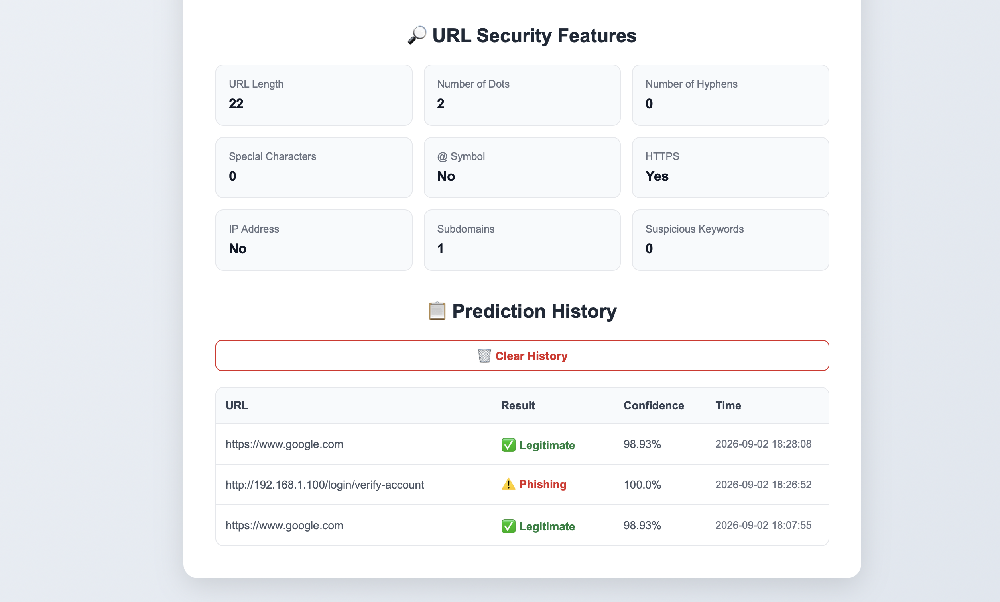
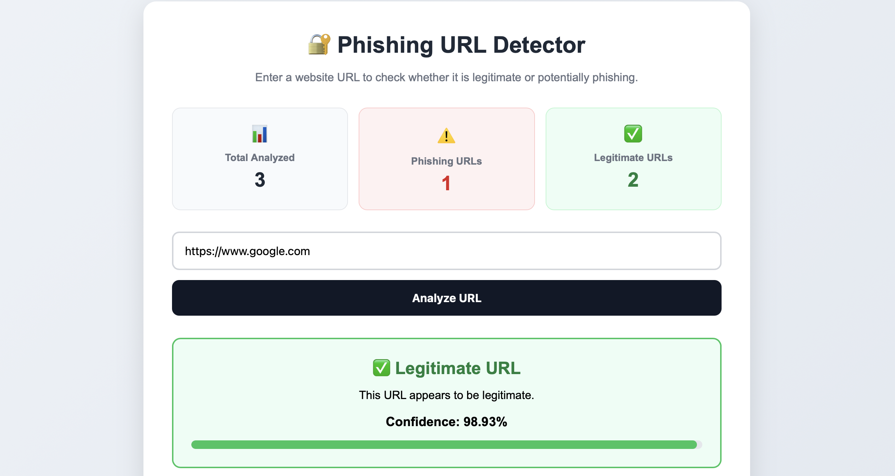
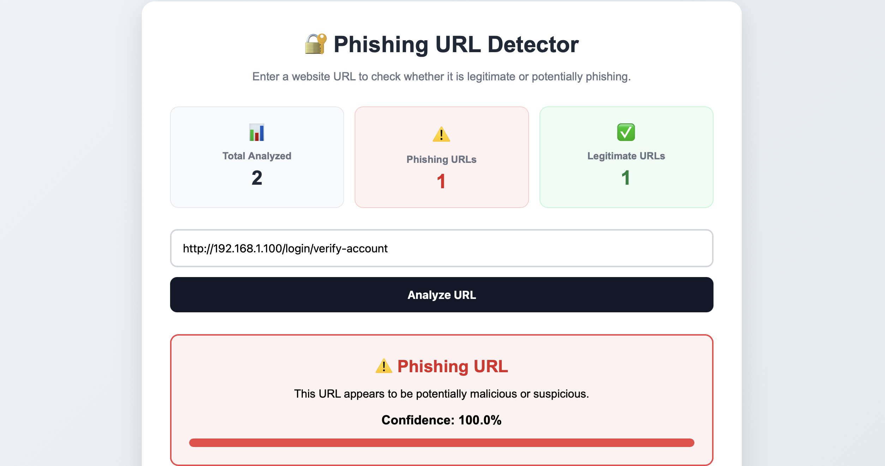
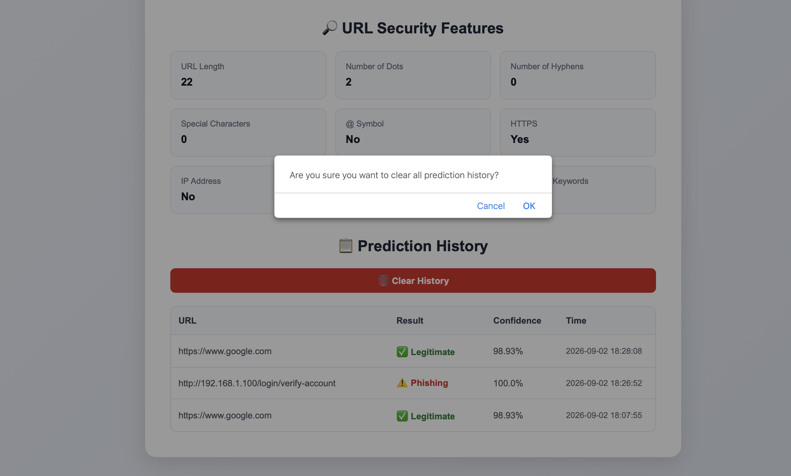

# 🔐 Phishing URL Detection System

A machine-learning-based web application that analyzes website URLs and predicts whether they are **legitimate or potentially phishing**.

The system extracts security-related characteristics from a URL and uses a **Random Forest Classifier** to make the prediction. It also provides a confidence score, URL security feature analysis, prediction history, and dashboard statistics.

---

## 📌 Project Overview

Phishing attacks use deceptive websites and URLs to trick users into revealing sensitive information such as usernames, passwords, banking details, and other personal data.

This project aims to provide a simple and user-friendly tool for analyzing URLs and identifying potentially suspicious links.

The application uses machine learning to analyze URL characteristics such as:

* URL length
* Number of dots
* Number of hyphens
* Special characters
* `@` symbol
* HTTPS usage
* IP address presence
* Number of subdomains
* Suspicious keywords
---

---

## 📸 Project Screenshots

### 🏠 Home Screen


### 🔍 URL Features



### ⚠️ Phishing URL Detection



### 📊 Dashboard



### 🗑️ Clear History




---

---
---

## ✨ Features

* 🔍 **Phishing URL Detection**
* 🤖 **Random Forest Machine Learning Model**
* 📊 **Approximately 94.11% Model Accuracy**
* 🎯 **Prediction Confidence Score**
* 📈 **Visual Confidence Bar**
* 🔎 **URL Security Feature Analysis**
* 🔗 **URL Format Validation**
* 💾 **SQLite Prediction History**
* 📊 **Dashboard Statistics**
* 🗑️ **Clear Prediction History**
* 📱 **Responsive Web Interface**

---

## 🛠️ Tech Stack

### Programming Language

* Python

### Backend

* Flask

### Machine Learning

* Scikit-learn
* Random Forest Classifier

### Data Processing

* Pandas
* NumPy

### Database

* SQLite

### Frontend

* HTML
* CSS

### Model Storage

* Joblib

### Dataset

* PhiUSIIL Phishing URL Dataset

---

## 🧠 Machine Learning Model

The project uses a **Random Forest Classifier** for URL classification.

### Features Used

| Feature                 | Description                                               |
| ----------------------- | --------------------------------------------------------- |
| URL Length              | Total number of characters in the URL                     |
| Dot Count               | Number of `.` characters                                  |
| Hyphen Count            | Number of `-` characters                                  |
| Special Character Count | Number of suspicious special characters                   |
| @ Symbol                | Checks whether `@` is present                             |
| HTTPS                   | Checks whether HTTPS is used                              |
| IP Address              | Checks whether an IP address is used instead of a domain  |
| Subdomain Count         | Number of subdomains in the URL                           |
| Suspicious Word Count   | Counts words such as login, verify, account, secure, etc. |

---

## 📊 Model Performance

The trained Random Forest model achieved approximately:

**94.11% Accuracy**

Classification performance:

| Class       | Precision |   Recall | F1-Score |
| ----------- | --------: | -------: | -------: |
| Phishing    |      0.97 |     0.89 |     0.93 |
| Legitimate  |      0.92 |     0.98 |     0.95 |
| **Overall** |  **0.94** | **0.94** | **0.94** |

The model was trained and evaluated using a train-test split with stratification.

---

## ⚙️ How the System Works

```text
User enters URL
       ↓
URL Validation
       ↓
Feature Extraction
       ↓
9 Security Features
       ↓
Random Forest Model
       ↓
Prediction
       ↓
Phishing / Legitimate
       ↓
Confidence Score
       ↓
Save Result in SQLite
       ↓
Display Dashboard & History
```

---

## 📂 Project Structure

```text
Phishing-URL-Detector/
│
├── dataset/
│   ├── phishing_dataset.zip
│   └── phishing_urls.csv
│
├── static/
│   └── style.css
│
├── templates/
│   └── index.html
│
├── app.py
├── feature_extraction.py
├── train_model.py
├── model.pkl
├── predictions.db
├── README.md
└── venv/
```

---

## 🚀 Installation

### 1. Clone the Repository

```bash
git clone <your-github-repository-url>
```

Navigate into the project:

```bash
cd Phishing-URL-Detector
```

---

### 2. Create a Virtual Environment

```bash
python3 -m venv venv
```

Activate it on macOS/Linux:

```bash
source venv/bin/activate
```

For Windows:

```bash
venv\Scripts\activate
```

---

### 3. Install Dependencies

```bash
pip install flask pandas numpy scikit-learn joblib
```

---

## 🧪 Train the Machine Learning Model

If you want to retrain the model:

```bash
python train_model.py
```

The trained model will be saved as:

```text
model.pkl
```

---

## ▶️ Run the Application

Start the Flask server:

```bash
python app.py
```

You should see:

```text
Running on http://127.0.0.1:5000
```

Open the URL in your browser:

```text
http://127.0.0.1:5000
```

---

## 🧪 Example Tests

### Legitimate URL

```text
https://www.google.com
```

Expected result:

```text
✅ Legitimate URL
```

### Suspicious URL

```text
http://192.168.1.100/login/verify-account
```

Expected result:

```text
⚠️ Phishing URL
```

> Note: Model predictions are based on learned URL patterns and should not be treated as a guarantee that a website is safe or malicious.

---

## 📊 Dashboard

The application provides a dashboard showing:

* **Total URLs Analyzed**
* **Phishing URLs**
* **Legitimate URLs**

These statistics are automatically updated whenever a URL is analyzed.

---

## 💾 Prediction History

Every successful URL analysis is stored in an SQLite database.

The history records:

* URL
* Prediction result
* Confidence score
* Analysis time

Users can also clear the complete prediction history using the **Clear History** button.

---

## 🔐 Security Features

The application analyzes multiple characteristics commonly associated with suspicious URLs, including:

* Excessively long URLs
* Multiple subdomains
* Suspicious keywords
* IP-based URLs
* Special characters
* `@` symbols
* HTTPS usage

These features are combined by the machine learning model to classify the URL.

---

## 🎯 Project Objectives

* Detect potentially phishing URLs using machine learning.
* Extract meaningful security features from URLs.
* Provide an easy-to-use web interface.
* Display prediction confidence to users.
* Maintain a history of analyzed URLs.
* Demonstrate practical applications of machine learning in cybersecurity.

---

## 🔮 Future Improvements

Possible future enhancements include:

* Integration with real-time threat intelligence APIs
* WHOIS and domain-age analysis
* DNS and SSL certificate analysis
* Google Safe Browsing integration
* More advanced URL and webpage features
* Deep learning-based detection
* Browser extension integration
* Cloud deployment
* User authentication
* Automated threat reporting

---

## 🎓 Academic / Portfolio Project

This project was developed as a cybersecurity and machine learning project to demonstrate practical skills in:

* Cybersecurity
* Machine Learning
* Python
* Flask
* Feature Engineering
* Database Management
* Web Development

---

## ⚠️ Disclaimer

This tool is intended for **educational and research purposes**.

A prediction from this system does not guarantee that a URL is completely safe or malicious. Users should avoid entering sensitive information on unfamiliar websites and use trusted security services for high-risk situations.

---

## 👩‍💻 Author

**Arshdeep Kaur**

Cybersecurity | Python | Machine Learning | Web Development
